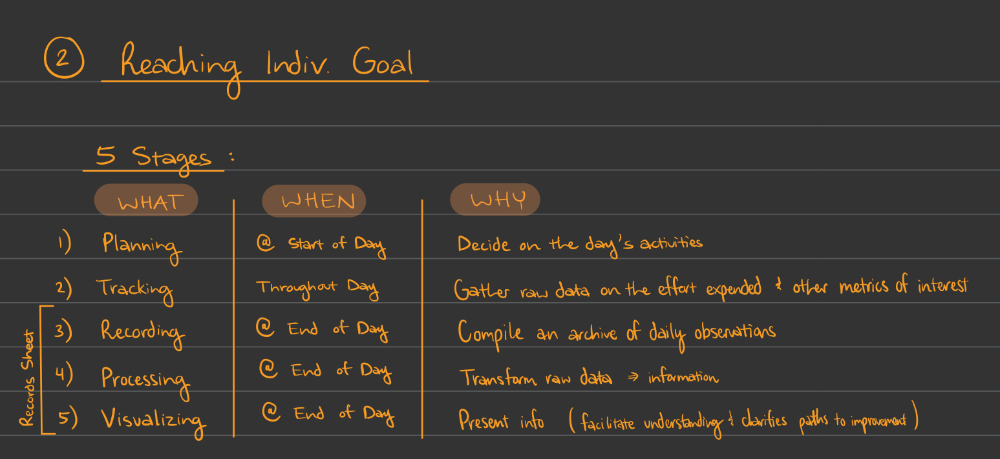

# Jan. 19th 2020 Group Wiki Finalizing (Group 29 aka Pomato)

## Meeting Details

- Type of meeting: Weekly Meeting
- Members present: Allen Zou, Andy Young, Annika Hatcher, Arman Mansourian, Don Wolfson, Enrique Gan, Justin Lee, Liam Stone, Teresa Truong
- Members absent: None
- Meeting location: ZOOM
- Start/finish time: 4:00 PM PST - 5:00 PM PST

## Meeting Goals

1. Look over unresolved things in the impromptu meeting.
2. Look over [Pomodoro Foundations](https://github.com/DonaldWolfson/cse110-w21-group29/blob/main/admin/booknotes/foundations.md)
3. SCRUM, SCRUM-ish, or no-SCRUM?
   - Should we implement the SCRUM model discussed in lecture today?
   - Should we implement some of the features? (i.e. product backlog, sprint backlog, increment, sprint concept/daily standup concept)
   - Alternatives?
4. Creating Product Outline
   - If we SCRUM, this entails creating the product backlog (make all the GitHub Issues we need to resolve to finish the product)
   - Look into GitHub Projects
5. Discuss people's comfortability with the allowed tools.
   1. JavaScript
   2. HTML
   3. CSS
   4. (Any Other allow tools)
6. Begin to assign psuedo-roles
   1. These don't need to be final, but just to help get things moving.

## Meeeting Notes

1. We verified that everyone added a rule to the contract and signed it. We also watched over Teresa's video and submitted it.
2. Went over the foundations page, emphasizing a clean & simple application that is supposed to reduce stress.
3. Discussed Scrum:
   1. The only other practice that we're aware of is Agile, but we decided against that because only a few people knew information about it. Agile wasn't covered in depth in class while SCRUM was.
   2. Create a project that is a sprint.
      1. Each issue is part of the backlog.
4. Began whiteboarding features.
   1. Arman is drawing notes on iPad.
      1. Future questions written on the notes
   2. Color scheme?
      1. We'll decide this later
         1. Allow the designers to decide?
         2. People seem to want red.
   3. Timer: Analog/Digital?
   5. When task completed, do we hide it, or keep it?
      1. Maybe group tasks so that completed tasks aren't deleted but don't take up space.
   6. Planning stage, how to handle this?
      1. Hide the clock till tasks are completely listed.
      2. Need to account for each stage of Javascript.
      
   6. Data persistence
      1. Should we prioritize this, or focus on front-end?
   7. When page is FIRST loaded, create a pop-up to add tasks to list.
   8. Discussed roles, currently following these [roles](https://docs.google.com/document/d/1FR5pI3Ucdy0-Y-BLFndcWxXcLjBmONAhhIdjr4WDZJQ/edit)
   9. Cool-Down / Feedback
      1. People are happy to learn new things, and are willing to pickup tasks they don't know.
      2. People are open to being reached out for any open/needed help.
      3. Creating a doc to add suggestions for design team to quickly produce a skeleton.
   10. Not on our agenda, but the team stuck around to look at some preemptive research and planning that Allen did to give everyone a better understanding of what to expect from the design team. The meeting is supposed to end at 5:00 PM as described at the top of these meeting notes, but it ended at 5:30 PM instead.

## Tasks to Complete

- Everyone
  - Fill out Google Doc that Teresa will send out with suggestions for the design to be considered by design team.
- Design Team
  - Meet up prior to next weeks meeting and create a solid design of the app to show to the weekly meeting.

## Goals for Next Meeting

- Review design and begin seperating features/items into bit-sized issues.
