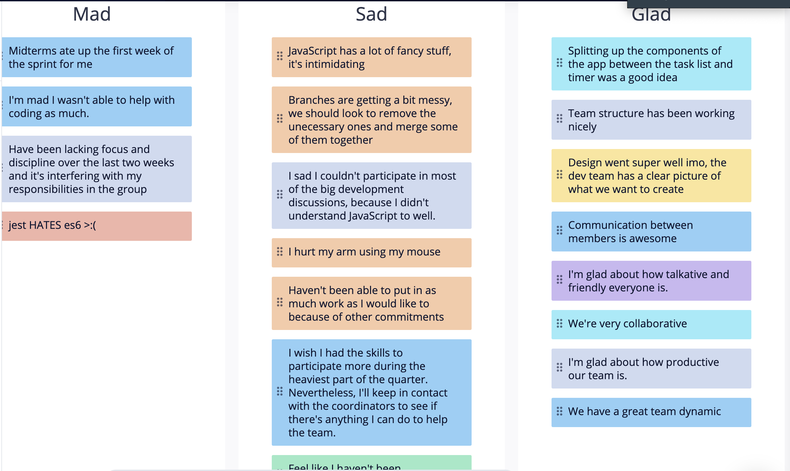
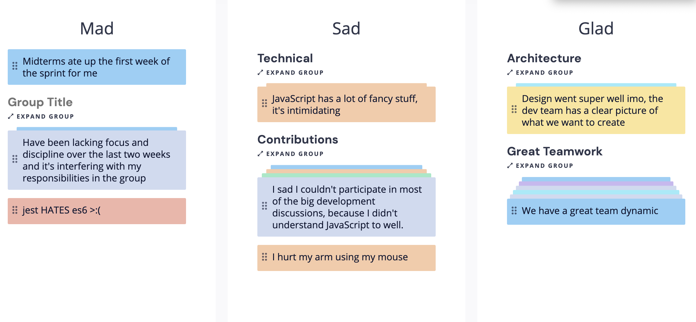
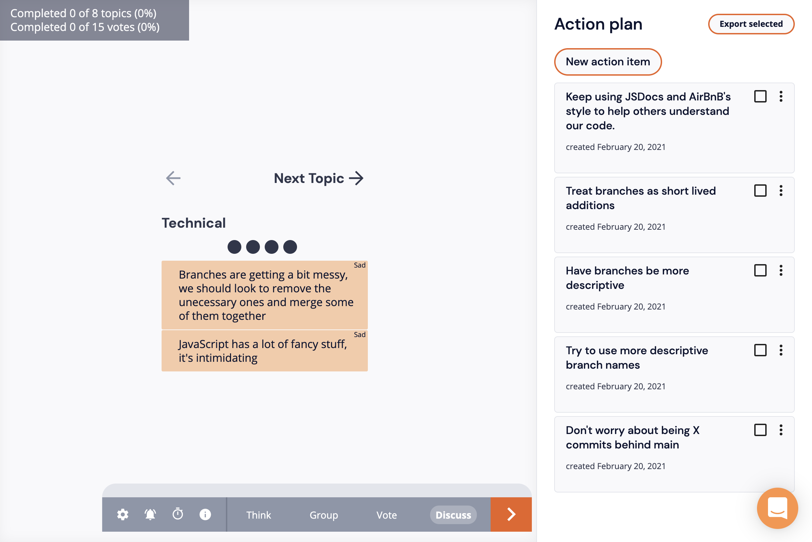
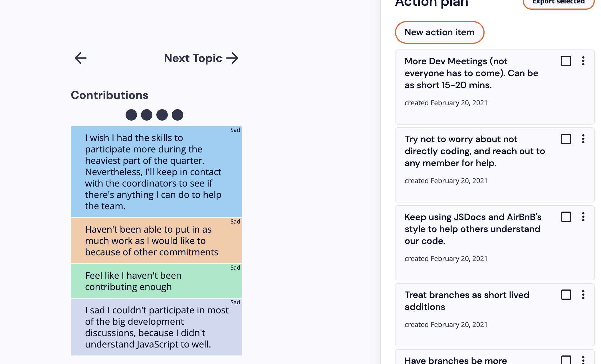
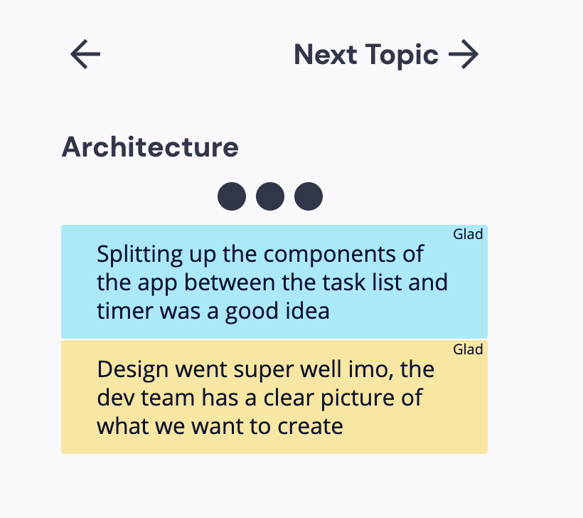
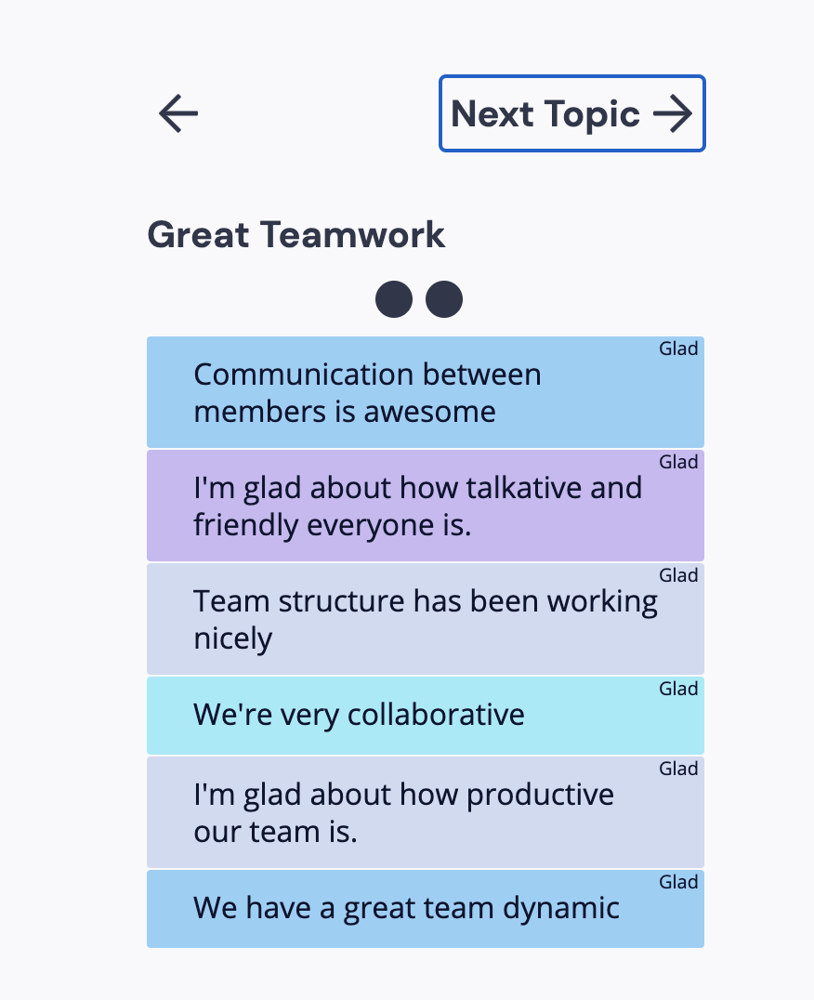

# Feb. 20th Retrospective Meeting

## Meeting Details

- Type of meeting: Retrospective
- Members present: Allen Zou, Arman Mansourian, Donald Wolfson, Enrique Gan, Justin Lee, Liam Stone
- Meeting location: ZOOM
- Start/finish time: 12:00 PM PST - 1:00 PM PST

## Meeting Goals

- [Sprint Retrospecive](https://canvas.ucsd.edu/courses/21783/assignments/259323)
  - Make sure everyone is set up to start
  - Think
  - Group
  - Vote
  - Discuss
- [Sprint Video](https://canvas.ucsd.edu/courses/21783/assignments/277675)
  - Try to get to this, but focus on the retrospective

## Sprint Retrospective

- Think

- Group

  - Everyone said we feel bad that we are contributing enough.
    - But we all said we have an awesome productive group.
    - Discussed if this is a good feeling (in a sense)
  - Mad about time constaints due to othe classes.
- Vote
- Discuss
  - Technical:
  
    - Messy Branches:
      - Everyone agrees out branches are messy.
      - Currently branches are cleaned, but they weren't during the sprint.
      - One idea: Dev Branch, Testing, Production
        - Might be too late for that
      - Try to have branches be smaller and more specific.
    - JavaScript is gross:
      - It is.
      - Not much we do about it, except emphasize JSDocs and AirBnB's style.
  - Contributions:
    
    - "Wish I had the skills to participate more":
      - Not all of us have to be coding.
      - There is plenty of work with SE outside of coding.
      - Maybe have more dev meetings on Zoom.
  - Architecture:
    
    - We need a Dev meeting before next sprint.
    - Most of this was already covered.
  - Great Teamwork:
    
    - It's a paradox that we also complain about not commiting enough.
    - I think we don't realize how well out team and work has been.
