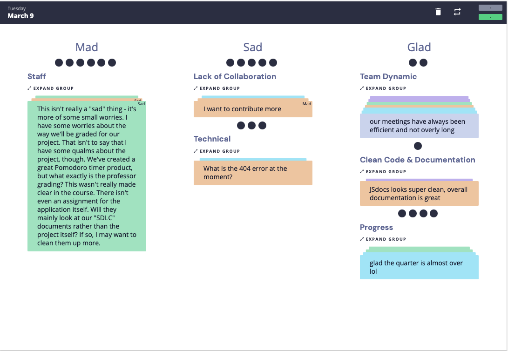
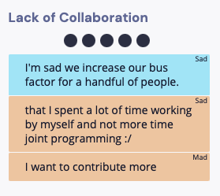
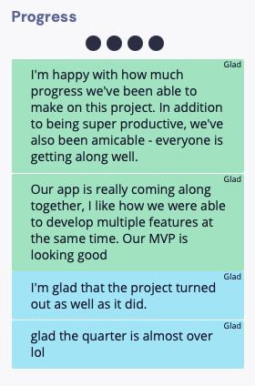
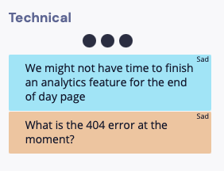
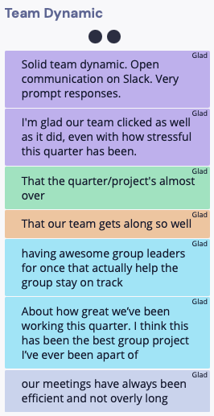
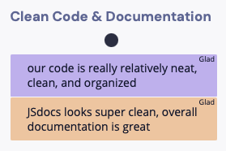
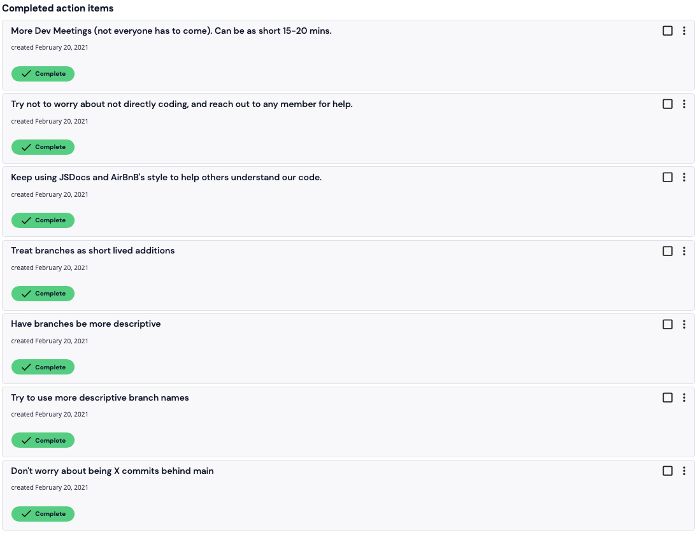

# Mar. 9th Retrospective Meeting

## Meeting Details

- Type of meeting: Retrospective
- Members present: Allen Zou, Arman Mansourian, Donald Wolfson, Enrique Gan, Justin Lee, Liam Stone, Annika Hatcher, Teresa Truoung
- Members absent: Andy Young
- Meeting location: ZOOM
- Start/finish time: 4:00 PM PST - 5:00 PM PST

## Meeting Goals

- [Sprint Retrospecive](https://canvas.ucsd.edu/courses/21783/assignments/259323). We'll be using [Retrium](https://app.retrium.com/team-room/22324a23-ea71-488d-aecc-a4c75f1d44ef?utm_campaign=team-room-invite&utm_content=link-invite&utm_invitedby=rrn%3Auser%3A28e36b15-2a03-4ec6-b803-d76436872c62&utm_medium=own-referral&utm_source=retrium) which the professor recommended, please sign up for an account with this link before the meeting.
  - Make sure everyone is set up to start
  - Think
  - Group
  - Vote
  - Discuss

## Sprint Retrospective

Mad Sad Glad Board:

- Think
- Group
- Vote
- Discuss
  - Lack of Collaboration
    - A lot of our issues/feature requests were small changes so it made sense that we weren't synchronously working.
    - We didn't take advantage of pair programming until really late into the quarter.
    - Some of use would fall behind on the code, so they couldn't keep up with each other's tasks.
    - Lack of communication meant that some code would be resolved by people who already were assigned to issues.
      - We could have taken advantage of the github issues more.

    

  - Progress
    - We all got a long really well.
    - Some people are very happy with how little conflict we had.
      - One of the first times some of our group members had a good group project experience.
    - People who weren't good at certain things found other tasks to work on.

    

  - Technical
    - People are worried about the final touches.
      - We'll get to what we can, and that's ok.

    

  - Team Dynamic
    - Great communication.
    - Team clicked well.
    - Super efficient.
    - This was the least stressfull class for a lot of us because of our dynamic.

    

  - Clean Code & Documentation

    

- Discussed Our Last Retrospective Action Plans
  - We met all our action plans,
    - Had more small and explicit branches
    - Cleaner code

    
