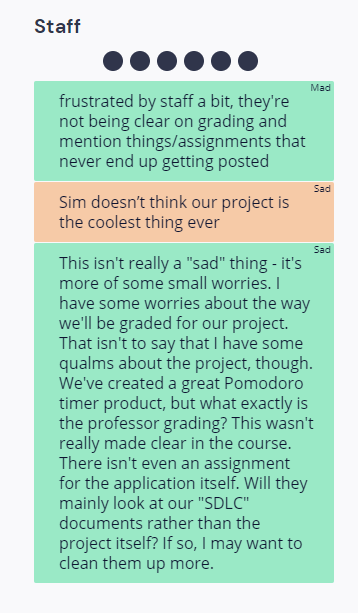
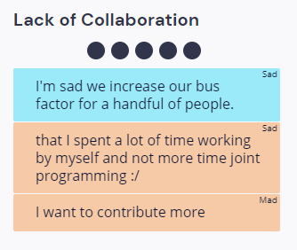
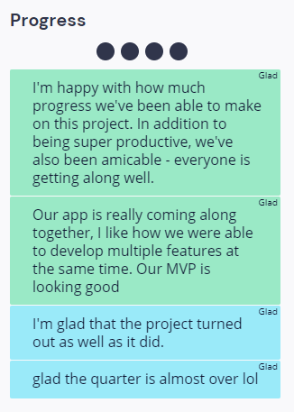
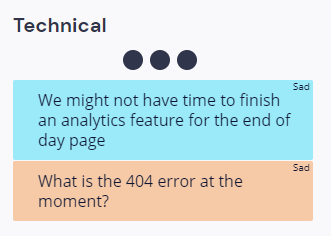
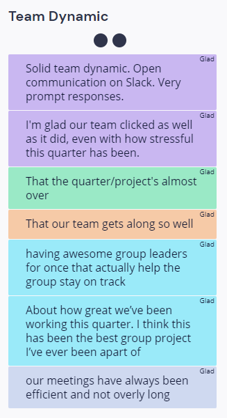
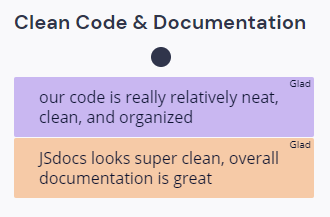

# Mar. 9th Retrospective Meeting

## Meeting Details

- Type of meeting: Retrospective
- Members present: Allen Zou, Arman Mansourian, Donald Wolfson, Enrique Gan, Justin Lee, Liam Stone
- Meeting location: ZOOM
- Start/finish time: 4:00 PM PST - 5:00 PM PST

## Meeting Goals

- [Sprint Retrospecive](https://canvas.ucsd.edu/courses/21783/assignments/259323). We'll be using [Retrium](https://app.retrium.com/team-room/22324a23-ea71-488d-aecc-a4c75f1d44ef?utm_campaign=team-room-invite&utm_content=link-invite&utm_invitedby=rrn%3Auser%3A28e36b15-2a03-4ec6-b803-d76436872c62&utm_medium=own-referral&utm_source=retrium) which the professor recommended, please sign up for an account with this link before the meeting.
  - Make sure everyone is set up to start
  - Think
  - Group
  - Vote
  - Discuss

## Sprint Retrospective

- Think
- Group
- Vote
  - We inadvertently missed the screenshots for these three sections and can't return to these parts of our retrospective.
- Discuss
  - Staff:
  
    - Concerns about grading:
      - Most of us think that the course seems very unstructured and unorganized, making it hard to figure out what we're truly supposed to do in terms of the project and Agile practice.
      - Despite this being the most voted grouping of posts, the team unanimously agreed that there isn't anything we can do about these concerns, so we moved on.
  - Lack of Collaboration:
  
    - We first addressed the concern of people not contributing enough to the team because this is a repeated concern that we had in the previous retrospective.
      - Once again, we think the team members shouldn't worry too much about this because we're being too hard on ourselves. As we will see in the later topics, we've put posts saying that our team dynamic is great.
      - Unfortunately, because the quarter natually gets heavy near finals week, it becomes significantly harder for team members to meet up and do pair programming. We don't need an action plan for this either because it's inexorable.
      - The increase in bus factor is something we weren't expecting. At the moment, it hasn't reached a dangerous level, but we should still be prudent about this. We should be focusing on the fact that we're still able to achieve a copious amount of work because the bus factor isn't high enough to hinder us from progressing.
  - Progress
  
    - This is a continuation from the previous retrospective meeting. Some members of the team expressed their gratitude for such a unique experience - for the first time for all of us, we've been in a truly productive team that diligently works toward making a great project.
    - Other than that, the first post in this grouping pretty much nailed the point, so we moved on.
  - Technical
  
    - We briefly discussed the 404 error on our website. Arman, Donald, and Teresa resolved it right before our retrospective meeting.
    - Donald helped improve the team morale because we were having qualms about our ability to add all of our desired features.
      - The goal is simple. Finish resolving the remaining issues on Github, and then go all out on the Analytics page. We already prepared the codebase for that page.
  - Team Dynamic
  
    - We didn't spend much time on this because most of the comments for this grouping of posts was already made in during our discussion for the "Progress" grouping.
  - Clean Code & Documentation
  
    - No one had comments about this, so we moved on.
