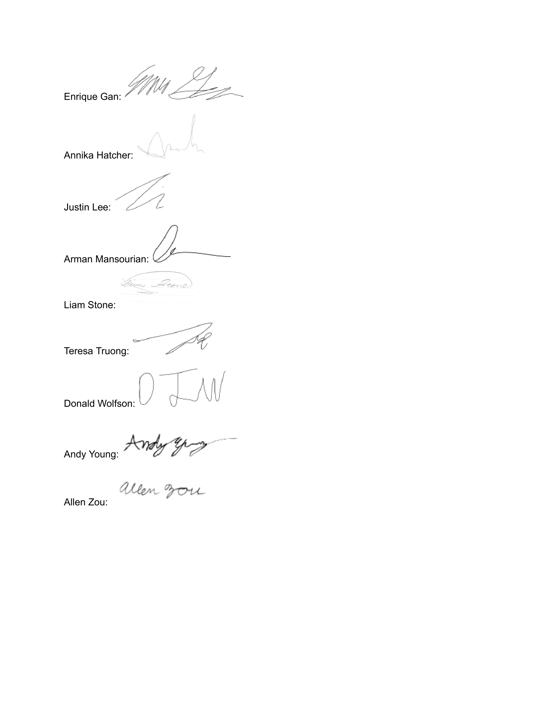

# Team Working Agreement

Term: Winter 2021  
Created: January 20, 2021  
Team: Group 29

## 1) Group Identification

| Name | Email | Phone |
|------|-------|-------|
|Enrique Gan|egan@ucsd.edu|(818) 427 7585|
|Annika Hatcher|anhatche@ucsd.edu|(310) 988 3208|
|Justin Lee|jtl006@ucsd.edu|(925) 548 9759|
|Arman Mansourian|armansou@ucsd.edu|(323) 573 9717|
|Liam Stone|lstone@ucsd.edu|(562) 305 0270|
|Teresa Truong|tetruong@ucsd.edu|(818) 334 9300|
|Donald Wolfson|dwolfson@ucsd.edu|(760) 519 5076|
|Andy Young|a7young@ucsd.edu|(808) 218 8306|
|Allen Zou|alzou@ucsd.edu|(713)898 6610|

## 2) Primary Means of Communication and  Expectations

Primary form of communication: Slack

- Keep slack notifications on or check up on the channel at least once a day.
- Respond with an emoji on important posts within 24 hours of posting.
- Respond with reply to @/@everyone or direct messages within 24 hours of posting.

Discussing project issues:

- Post project related issues on GitHub Issues within the repo.
- Discussions about existing issues take place on the #github-issues channel in Slack.

## 3) Schedule Meetings

Weekly Meetings: Fridays, 4:00pm to approximately 5:00pm. We will also have casual meet-ups at various times to get to know each other better.

## 4) General Responsibilities/Values for ALL Team Members

- Prompt/proactive communication through Slack or Github. Acknowledge communications with reactions (comments, emojis, etc.) for important posts.
- Be honest and transparent about your tasks current/upcoming events.
- Respect each other’s time. If it’s an emergency, Slack’s force notification or text messages can be used. Otherwise, try to get back to people within 24 hours.
- At the beginning of each weekly meeting, everyone is expected to share an update/status report on progress, issues, accomplishments, etc. Updates are to keep everyone on the same page.
- If you’re stuck, ask for help! Someone might know the answer and speed the troubleshooting up. We are still learning and no-one is expected to be a pro, the better we can communicate road blocks the easier we can overcome them.
- Be a team player. Show fair and honest effort. To succeed, we all have to do our part. Complete tasks on time and to the best of your ability. 
  - If you are unable to complete a task, communicate with the team so that we can accommodate—the sooner the better while the issue is small.
  - Please don’t procrastinate. 
  - Lend a helping hand when someone is reaching out for help.

## 5) Conflict Resolution

- Group conflict resolution: majority vote (5/9 required) to reach consensus on decisions regarding components of the project.
- Personal conflict resolution:
  1. Direct private communication through Slack
  2. Zoom Meeting (Minimum: 15 minutes)
  3. Zoom Meeting with Sim
  4. Zoom Meeting with Professor Powell

## 6) Expectations of Faculty and GTA’s

If a major conflict issue arises, reach out to Sim.

## Team Signatures

